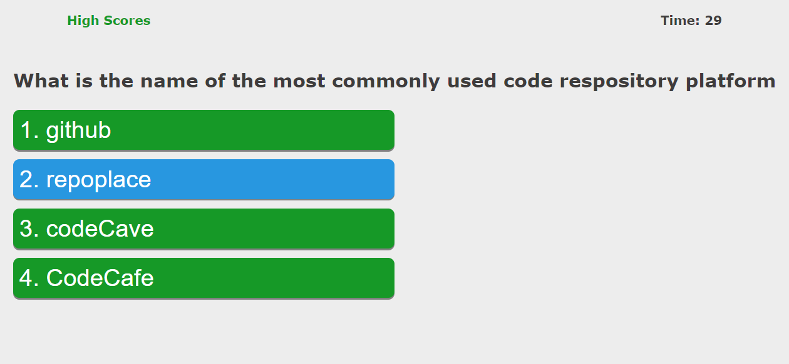

# fictional-invention | Javascript Coding Quiz
Module 4 

The goal of this project was to build a Javascript application that uses DOM to create a coding quiz. It uses local storage to store high scores. 

## Images

